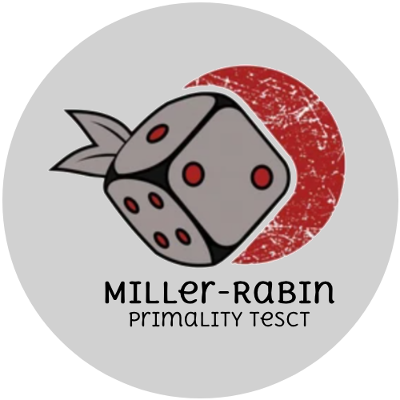

<h1 align="center">
  </img>
  <br>
  <b>Miller Rabin</b>
</h1>

<p align="center">Probabilistic Primality test.</p>

<!-- Badges -->
<p align="center">
  <a href="https://github.com/QuanBlue/miller-rabin/graphs/contributors">
    
  </a>
  <a href="">
    
  </a>
  <a href="https://github.com/QuanBlue/miller-rabin/network/members">
    
  </a>
  <a href="https://github.com/QuanBlue/miller-rabin/stargazers">
    
  </a>
  <a href="https://github.com/QuanBlue/miller-rabin/issues/">
    
  </a>
  <a href="https://github.com/QuanBlue/miller-rabin/blob/main/LICENSE">
    
  </a>
</p>

<p align="center">
  <b>
    <a href="https://github.com/QuanBlue/miller-rabin">Documentation</a> •
    <a href="https://github.com/QuanBlue/miller-rabin/issues/">Report Bug</a> •
    <a href="https://github.com/QuanBlue/miller-rabin/issues/">Request Feature</a>
  </b>
</p>

<br />

<details open>
<summary>Table of Contents</summary>

-  [Getting Started](#getting-started)
   -  [Prerequisites](#prerequisites)
   -  [Run Locally](#run-locally)
-  [Benchmark](#benchmark)
-  [Roadmap](#roadmap)
-  [Contributors](#contributors)
-  [Credits](#credits)
-  [License](#license)

# Getting Started

## Prerequisites

Before proceeding with the installation and usage of this project, ensure that you have the following prerequisites in place:

-  **g++**: the GNU C++ complier, install [here for VSCode](https://code.visualstudio.com/docs/cpp/config-mingw)

## Run Locally

**Step 1:** Extract dataset file at `./dataset/billion-primes.7z`

> You can download at [here](https://github.com/bauripalash/bpp?fbclid=IwAR0z5uRxI1fYtzv9THQb5gK9iGbNGbEhZXM6av7V26RSVVOwcLU79AcAYlA_aem_AR9i2LabMtvQqOqQlC2kkDWeMgFsbRFR5XC9axt7Q_q6G3IbwCCDX9wqDMobiJ_M_UZFfk3cQsL3JQX2wo7btHh-)

**Step 2:** Compile program, it will generate `miller_rabin` file (executable file) from `miller_rabin.cpp`:

```bash
g++ -o miller_rabin miller_rabin.cpp
```

**Step 3:** Run executable file and wait :))

```bash
./miller_rabin
```

# Benchmark

Using a simple C++ script which took about `4 minute 51 seconds`

```txt
  /=================================\
  |                                 |
  |          MILLER RABIN           |
  |      ____________________       |
  |  Probabilistic primality test   |
  |                                 |
  \=================================/
       \_______QuanBlue_______/


Benchmarking...Done!

=================================
- Total test        : 1000000000
- Total correct     : 999998700
- Total runtime     : 291096 ms
=================================
[>] Average runtime: 0.000291096 ms
[>] Average correct: 99.9999%
```

# Roadmap

-  [x] Miller Rabin algorithm
-  [x] Benchmark

# Contributors

<a href="https://github.com/QuanBlue/miller-rabin/graphs/contributors">
  
</a>

Contributions are always welcome!

# Credits

-  [Cpp](https://www.cplusplus.com/)
-  [g++](https://gcc.gnu.org/)
-  [Miller-Rabin algorithm](https://en.wikipedia.org/wiki/Miller%E2%80%93Rabin_primality_test)
-  [Billion prime](https://github.com/bauripalash/bpp?fbclid=IwAR0z5uRxI1fYtzv9THQb5gK9iGbNGbEhZXM6av7V26RSVVOwcLU79AcAYlA_aem_AR9i2LabMtvQqOqQlC2kkDWeMgFsbRFR5XC9axt7Q_q6G3IbwCCDX9wqDMobiJ_M_UZFfk3cQsL3JQX2wo7btHh-)
-  [Generate prime](https://bigprimes.org/)
-  [Test is prime online](https://www.dcode.fr/primality-test)

# License

Distributed under MIT license. See
[LICENSE](./LICENSE) for more
information.

---

> Bento [@quanblue](https://bento.me/quanblue) &nbsp;&middot;&nbsp;
> GitHub [@QuanBlue](https://github.com/QuanBlue) &nbsp;&middot;&nbsp; Gmail quannguyenthanh558@gmail.com
